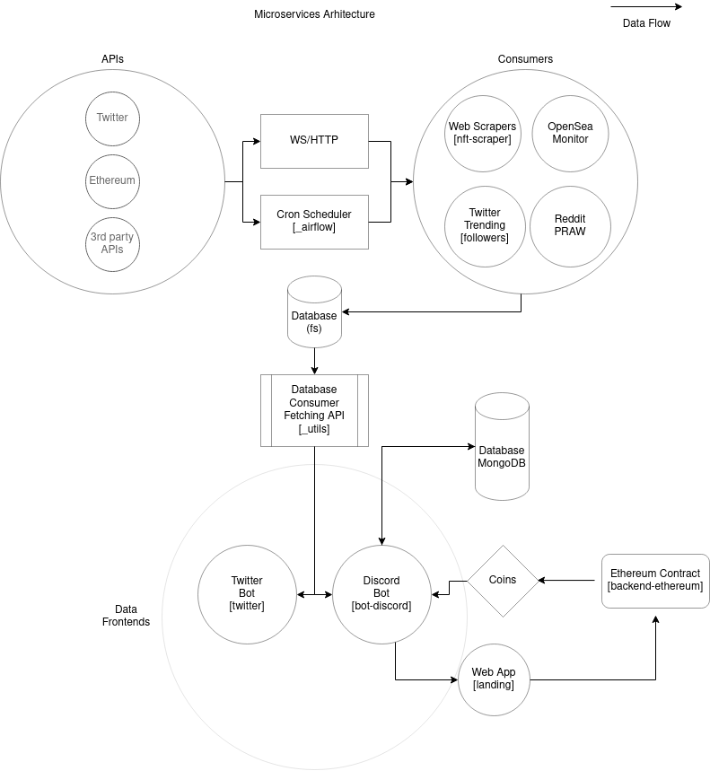

### Automated bot system

The  system fectches relevant data from multiple API and exposes to frontend clients (Discord/Twitter). All submodules are atounomous modules that talk through HTTP. 

### Scheme of work



### Start

##### Docker

```
docker compose up
```

##### Manually

```
- start logger
- start twitter
- ./activate => sign in to accouts server-twitter.log | ./post.sh to check
- start opensea-monitor
- start database-mongo
- start reddit-praw
- start bot 
```